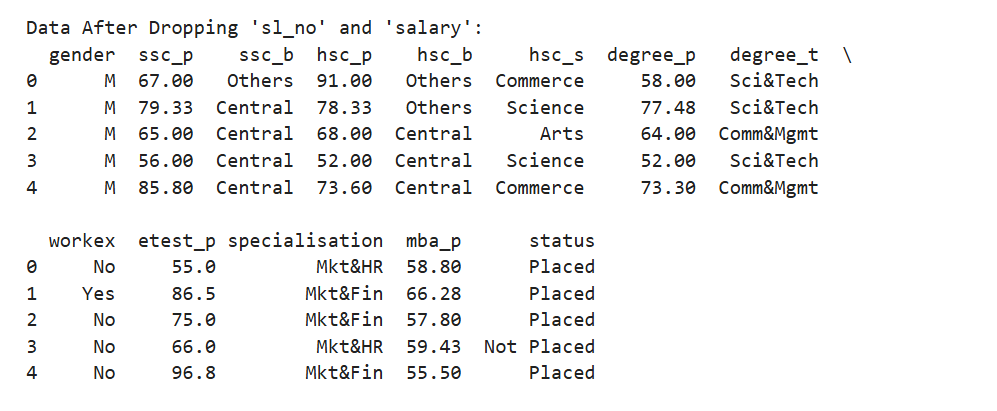
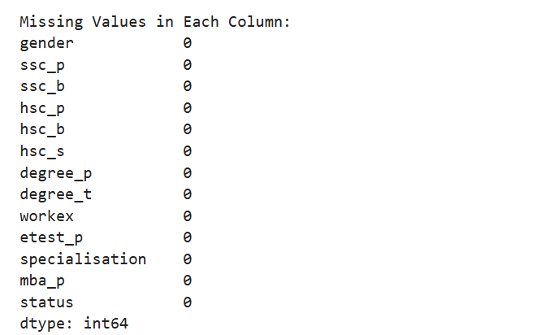
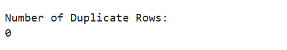
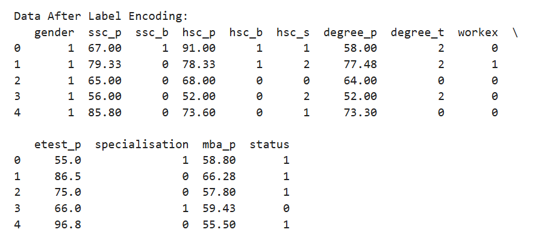

## Implementation-of-Logistic-Regression-Model-to-Predict-the-Placement-Status-of-Student
## AIM:

To write a program to implement the Logistic Regression Model to predict the placement status of students.

## Equipments Required:

Hardware – PCs

Anaconda – Python 3.7 Installation / Jupyter Notebook

## Algorithm:

Import the required libraries such as Pandas, Scikit-learn, and Logistic Regression model.

Load the dataset and perform preprocessing (drop unnecessary columns, handle missing values, and encode categorical data).

Split the dataset into features (X) and target (Y), then divide it into training and testing sets.

Train the Logistic Regression model using the training dataset.

Predict the placement status using the test dataset.

Evaluate the model using Accuracy Score, Confusion Matrix, and Classification Report.

Perform a custom prediction to check placement status with given input data.

## Program:
```
'''
Program to implement the Logistic Regression Model to Predict the Placement Status of Student.
Developed by: SUDHARSAN S
RegisterNumber: 212224040334

'''

# ==============================
# 1. Import Libraries
# ==============================
import pandas as pd
from sklearn.preprocessing import LabelEncoder
from sklearn.model_selection import train_test_split
from sklearn.linear_model import LogisticRegression
from sklearn.metrics import accuracy_score, confusion_matrix, classification_report


# ==============================
# 2. Load the Dataset
# ==============================
data = pd.read_csv("Placement_Data.csv")
print("Original Data (First 5 Rows):")
print(data.head(), '\n')


# ==============================
# 3. Data Cleaning
# ==============================
data1 = data.copy()
data1 = data1.drop(["sl_no", "salary"], axis=1)  # Dropping unnecessary columns
print("Data After Dropping 'sl_no' and 'salary':")
print(data1.head(), '\n')

print("Missing Values in Each Column:")
print(data1.isnull().sum(), '\n')

print("Number of Duplicate Rows:")
print(data1.duplicated().sum(), '\n')


# ==============================
# 4. Encoding Categorical Variables
# ==============================
le = LabelEncoder()
data1["gender"] = le.fit_transform(data1["gender"])
data1["ssc_b"] = le.fit_transform(data1["ssc_b"])
data1["hsc_b"] = le.fit_transform(data1["hsc_b"])
data1["hsc_s"] = le.fit_transform(data1["hsc_s"])
data1["degree_t"] = le.fit_transform(data1["degree_t"])
data1["workex"] = le.fit_transform(data1["workex"])
data1["specialisation"] = le.fit_transform(data1["specialisation"])
data1["status"] = le.fit_transform(data1["status"])

print("Data After Label Encoding:")
print(data1.head(), '\n')


# ==============================
# 5. Feature Selection
# ==============================
x = data1.iloc[:, :-1]   # Independent variables
y = data1["status"]      # Target variable

print("Features (X):")
print(x.head(), '\n')

print("Target (Y):")
print(y.head(), '\n')


# ==============================
# 6. Train-Test Split
# ==============================
x_train, x_test, y_train, y_test = train_test_split(
    x, y, test_size=0.2, random_state=0
)


# ==============================
# 7. Model Training
# ==============================
lr = LogisticRegression(solver="liblinear")
lr.fit(x_train, y_train)


# ==============================
# 8. Model Prediction
# ==============================
y_pred = lr.predict(x_test)
print("Predicted Values:")
print(y_pred, '\n')


# ==============================
# 9. Model Evaluation
# ==============================
accuracy = accuracy_score(y_test, y_pred)
print("Accuracy Score:", accuracy, '\n')

confusion = confusion_matrix(y_test, y_pred)
print("Confusion Matrix:")
print(confusion, '\n')

classification_report1 = classification_report(y_test, y_pred)
print("Classification Report:")
print(classification_report1)


# ==============================
# 10. Custom Prediction
# ==============================
# Example input: [gender, ssc_p, ssc_b, hsc_p, hsc_b, hsc_s, degree_p, degree_t, workex, etest_p, specialisation, mba_p]
custom_input = [[1, 80, 1, 90, 1, 1, 90, 1, 0, 85, 1, 85]]
prediction = lr.predict(custom_input)
print("Custom Prediction (Placement Status):", prediction)
```
## Output:
1. Original Data (First 5 Rows)


2. Data After Dropping 'sl_no' and 'salary'



3. Missing Values in Each Column



4. Number of Duplicate Rows



5. Data After Label Encoding



6. Features (X)


7. Target (Y)

 


8. Predicted Values (Y_pred)


9. Accuracy Score


10. Confusion Matrix


11. Classification Report


12. Custom Prediction (Placement Status)


## Result:

Thus the program to implement the Logistic Regression Model to predict the placement status of students is written and verified using Python programming.
